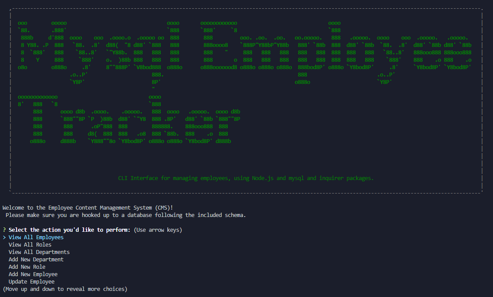

# MySQL Employee Content Management System (CMS)

  

  ## Description:

  Command-line application using node.js, inquirer, and MySQL to make and maintain a Content Management System (CMS) for keeping track of an organization's employees.

  

[Link to Repo](https://github.com/GAFelton/mysql-employee-tracker-10)

  ## Table of Contents

 * [Installation](#Installation)

 * [Usage](#Usage)

 * [License](#License)

 * [Contributing](#Contributing)

 * [Questions](#Questions)

   

  

  ## Installation

    1. Fork the repo. 
    2. Clone it to your local machine. 
    3. Install npm packages with `npm install`. 
    4. Set up MySQL server using schema.sql (and optional seeds.sql file). 
    5. Run the CLI application using `node app.js`.

  

  ## Usage

 Cycle through the main prompt menu to find options for viewing Employees, Departments, and Roles, adding new Employees, Departments, and Roles, Updating Employee info, Removing Employees from the database, viewing Employees by Manager, and more.

  ## License

  MIT

  

  ## Contribution Guidelines

  Issues and Pull Requests are welcome!

  

  ## Questions

  Please address questions to GAFelton.

  [Link to Profile](https://github.com/GAFelton)

  [E-mail](gafelton@gmail.com)

  
